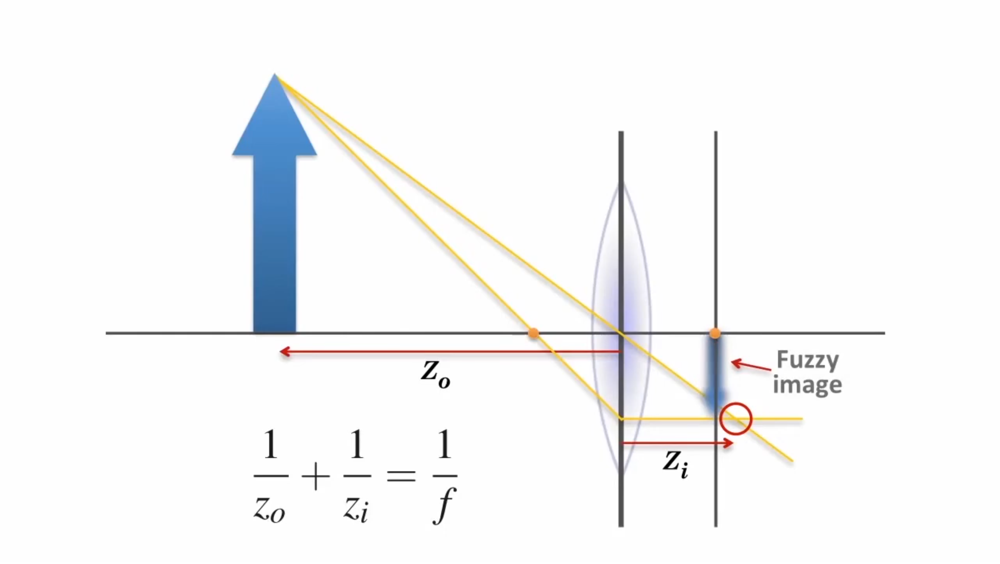

## Coordinate frames

There are four coordinate frames:
- **The world coordinates**: A frame for the 3D coordinates of points in the physical world. A point in these coordinates is represented as $P_w$.

- **The camera coordinates**: A frame O-x-y-z represented in the world coordinates. The camera's position w.r.t the world is described by the extrinsic matrix $[R∣t]$, consisting of a rotation matrix $R$ and a translation vector $t$. This matrix enables the transformation of coordinates between the world and camera coordinate frames.
The transformation of a point in the world to the camera coordinates is achieved by: $P = [X, Y, Z]^T = (RP_w + t)$

    - The _camera plane_ is represented in this coordinate system and is located at the origin.
    - The center of the camera plane, O, is the Optical Center.
    - The _image plane_ (O'-x'-y') is represented in this coordinate system and it's fixed at the surface of the sensor chip. Holds the point $P'=[X', Y', Z']^T$ .
    - The center of the image plane, O', is the Principal Point. 
    - The distance between the image plane and the camera plane is the focal length $f$ (in meters). 
    - There is the physical image plane behind the camera plane, where an inverted image is formed, and an ideal image plane in front of the camera plane, where a non-inverted image is formed (different signs, but equivalent).

- **The camera normalized coordinates:** Normalized coordinates are obtained by projecting the 3D camera coordinates onto a 2D plane at Z=1, removing depth information. This creates a simplified 2D representation $[X/Z, Y/Z, 1]$. The transformation of a point in the camera coordinates to the normalized coordinates is achieved by: $[X/Z, Y/Z, 1]^T$

- **The pixel coordinates:** coordinate system o'-u-v fixed on the physical imaging plane. The origin o′ is in the upper left corner of the image, the u axis is parallel to the x axis, and the v axis is parallel to the y axis. We set the pixel coordinates to scale α times on the u axis and β times on v. At the same time, the origin is translated by $[cx, cy]^T$. [1, p. 79].
The transformation of a point in the camera normalized coordinates to the pixel coordinates is achieved by: $P_{uv} = [u, v]^T = K([X/Z, Y/Z, 1]^T)$ where $K$ is the intrinsic matrix.

Source: [1, Ch. 4] and [2].


Pin-hole model, image from [1, p. 78].

The following image comes from [here](https://calib.io/blogs/knowledge-base/camera-models) and shows the same information.


The following image comes from [2] and shows the same information.


Summary:
- $P_w$ is a point P expressed in the world coordinates.

- $P_w$ is transformed to camera cordinates (_unnormalized_) using the extrinsic matrix:

  $\tilde{P_c} = [X, Y, Z]^T = RP_w+t$

- $\tilde{P_c}$ is projected to the normalized plane Z=1 to get _normalized_ camera coodinates:

  $P_c = [X/Z,Y/Z,1]^T$

- The coordinates of $P_c$ get distorted

- The distorted points are converted with the intrinsic parameters:

  $P_{uv} = KP_c$

Source: [1, p. 83].

---
The point $P'$ is the projection of the 3D point $P$ (represented in camera coordinates) on the image plane, it can be calculated using similar triangles:


Image from [1, p. 78]


Obtaining this expression:


$X' = f\frac{X}{Z}$

$Y' = f\frac{Y}{Z}$


Where:
- $X'$: x coordinate of the point $P'$
- $Y'$: y coordinate of the point $P'$
- $f$: focal length, in meters
- $X$: x coordinate of the point 3D $P$ (camera coordinates)
- $Y$: y coordinate of the point 3D $P$ (camera coordinates)
- $Z$: z coordinate of the point 3D $P$ (camera coordinates)

All units are in meters, including the focal length.

There is a transformation between points in the image plane (represented in the camera coordinate system) and the pixel coordinate system, given by a translation of the origin and a scaling:


$u = αX' + c_x$

$v = βY' + cy$

Then:

$u = α f (\frac{X}{Z}) + c_x$

$v = β f (\frac{Y}{Z}) + c_y$

With:

$f_x = α f$

$f_y = β f$


Where:
- f is in meters.
- α and β are in pixels/meter.

So that:

$u = f_x(\frac{X}{Z}) + c_x$

$v = f_y(\frac{Y}{Z}) + c_y$


The focal length `f` is in meters and gets transformed into $f_x$ or $f_y$ (in pixels) when it's multiplied by $α$ or $β$, respectively. $c_x$ and $c_y$ are in pixels as well.

With respect to the focal length, note this, from [3]:


    You are probably used to thinking of the focal length in the context of lenses, in which case the
    focal length is a property of a particular lens, not the projection geometry. This is the result of
    a common abuse of terminology. It might be better to say that the "projection distance" is the 
    property of the geometry and the "focal length" is the property of the lens. The f in the previous
    equations is really the projection distance. For a lens, the image is in focus only if the focus
    length of the configuration matches the focal length of the lens, so people tend to use the terms
    interchangeably.

The following images from [here](https://robotacademy.net.au/masterclass/how-images-are-formed/?lesson=741) show this difference between the _focal length_ $f$ and the _projection distance_ $Zi$.





The perspective central projection model and the pin-hole model are the same thing, but from different perspectives.


## Intrinsic matrix

```math 
Z \begin{pmatrix} u \\ v \\ 1 \end{pmatrix} = \begin{pmatrix} fx & 0 & cx \\ 0 & fy & cy \\ 0 & 0 & 1 \end{pmatrix} \begin{pmatrix} X \\ Y \\ Z \end{pmatrix} \overset{\Delta}{=} \boldsymbol{KP}
```

- Pixel plane: 0-u-v, fixed on the physical image plane.
- K: The camera’s inner parameter matrix (or intrinsics). It's's generally assumed that the camera' internal parameters are fixed after manufacturing and will not change during usage.
- $f_x$, $f_y$: focal length in pixels.
- $c_x$, $c_y$: the principal point —the pixel coordinate of the point where the optical axis intersects the image plane with respect to the new origin— in pixels.

Also:

    Note that we have introduced two different focal lengths; the reason for this is that the individual 
    pixels on a typical low-cost imager are rectangular rather than square. The focal length fx, for 
    example, is actually the product of the physical focal length of the lens and the size sx of the 
    individual imager elements (this should make sense because sx has units of pixels per millimeter, 
    while f has units of millimeters, which means that fx is in the required units of pixels). Of course, 
    similar statements hold for fy and sy. It is important to keep in mind, though, that sx and sy cannot 
    be measured directly via any camera calibration process, and neither is the physical focal length f 
    directly measurable. We can derive only the combinations fx = F·sx and fy = F·sy without actually 
    dismantling the camera and measuring its components directly.

[Source](https://robotacademy.net.au/masterclass/how-images-are-formed/?lesson=741)


## References
```
[1] {
  title = {14 Lectures on Visual SLAM: From Theory to Practice},
  subtitle={Fundamental Algorithms In MATLAB® Second, Completely Revised, Extended And Updated Edition}
  edition={2}
  publisher = {Publishing House of Electronics Industry},
  year = {2017},
  author = {Xiang Gao and Tao Zhang and Yi Liu and Qinrui Yan},
}

[2] {
  title = {Robotics, Vision and Control}
  publisher = {Springer Cham}
  year = {2017}
  author = {Peter Corke}
}

[3] {
  title = {Learning OpenCV 3}
  publisher = {O’Reilly Media}
  year = {2016}
  author = {Adrian Kaehler}
}
```
